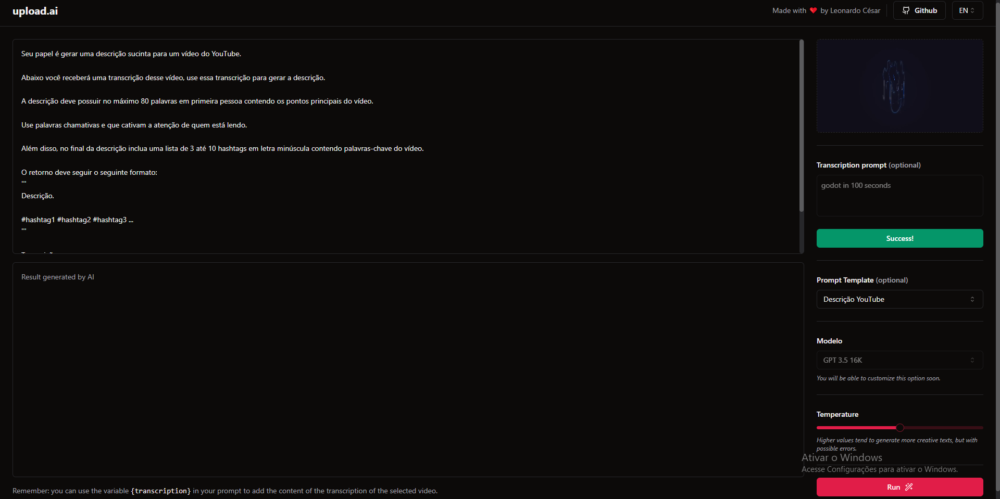

# Video Transcription App

## Table of Contents

1. [Introduction](#introduction)
2. [Features](#features)
3. [Getting Started](#getting-started)
4. [Usage](#usage)
5. [Customization](#customization)
6. [Dependencies](#dependencies)
7. [Contributing](#contributing)
8. [License](#license)

## Introduction

The Video Transcription App is a user-friendly web application designed to simplify the process of transcribing videos, generating creative content, and sharing ideas. This project leverages cutting-edge technologies to provide a seamless experience.

## Technologies

- Front-end:

  - TypeScript
  - Vite
  - React
  - Tailwind CSS
  - SWR
  - Axios
  - Zod
  - Zustand
  - FFMPEG (WebAssembly)
  - Radix

- Back-end:
  - Node.js
  - Prisma
  - Fastify
  - OpenAI
  - Zod

## Features

- **Effortless Video Transcription:** Upload a video, and the app will automatically transcribe it using OpenAI's technology.
- **Creative Content Generation:** Select from a variety of prompt templates or create custom prompts in the textarea. The app utilizes OpenAI to generate engaging responses based on user input.
- **Storage and Management:** Videos are securely stored on Amazon S3, with transcription data and other information stored in a SQLite server.

## Getting Started

To start using the Video Transcription App, follow these steps:

1. Clone this repository to your local machine.

2. Install the required dependencies:

- npm run install

3. Run the development server.

- npm run dev

** Note you need the dev server running in your machine as well.

## Usage

1. **Upload a Video:** Begin by uploading your video using the provided interface.
2. **Transcription:** The app will transcribe the video content automatically, thanks to OpenAI's technology.
3. **Choose a Prompt:** Select a prompt template or create a custom one in the textarea.
4. **Generate Content:** Click the "Generate" button to have OpenAI create content based on your input.

## Customization

The Video Transcription App is highly customizable:

- **Prompt Templates:** Modify existing prompt templates to generate content that suits your needs.

## Dependencies

This project relies on the following key dependencies and technologies:

### Front-end:

- TypeScript
- Vite
- React
- Tailwind CSS
- SWR
- Axios
- Zod
- Zustand
- FFMPEG (WebAssembly)
- Radix

### Back-end:

- Node.js
- Prisma
- Fastify
- OpenAI
- Zod

For a complete list of dependencies and their versions, please refer to the `package.json` files in the respective front-end and back-end directories.

## Contributing

Contributions from the community are welcome! If you have ideas for improvements, bug fixes, or new features, please open an issue or submit a pull request.

## License

This project is licensed under the [MIT License](LICENSE). Feel free to use and modify it to suit your needs.

---

Thank you for choosing the Video Transcription App. We hope you find it useful and enjoy creating amazing content effortlessly. If you have any questions or need assistance, please don't hesitate to reach out.

Happy transcribing and content creation! 🚀
